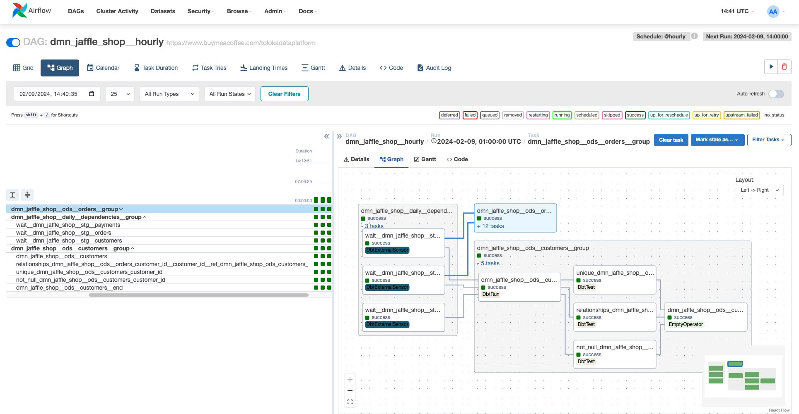

[](https://pypi.org/project/dbt-af/)
[](https://github.com/Toloka/dbt-af/actions)

[](https://www.apache.org/licenses/LICENSE-2.0.txt)
[](https://pypi.org/project/dbt-af/)
[](https://pypi.org/project/dbt-af/)

[](https://python-poetry.org/)
[](https://github.com/psf/black)

# dbt-af: distributed run of dbt models using Airflow

## Overview

**_dbt-af_** is a tool that allows you to run dbt models in a distributed manner using Airflow.
It acts as a wrapper around the Airflow DAG,
allowing you to run the models independently while preserving their dependencies.



### Why?

1. **_dbt-af_** is [domain-driven](https://www.datamesh-architecture.com/#what-is-data-mesh).
   It is designed to separate models from different domains into different DAGs.
   This allows you to run models from different domains in parallel.
2. **_dbt-af_** is **dbt-first** solution.
   It is designed to make analytics' life easier.
   End-users could even not know that Airflow is used to schedule their models.
   dbt-model's config is an entry point for all your settings and customizations.
3. **_dbt-af_** brings scheduling to dbt. From `@monthly` to `@hourly` and even [more](examples/manual_scheduling.md).
4. **_dbt-af_** is an ETL-driven tool.
   You can separate your models into tiers or ETL stages
   and build graphs showing the dependencies between models within each tier or stage.
5. **_dbt-af_** brings additional features to use different dbt targets simultaneously, different tests scenarios, and
   maintenance tasks.

## Installation

To install `dbt-af` run `pip install dbt-af`.

To contribute we recommend to use `poetry` to install package dependencies. Run `poetry install --with=dev` to install
all dependencies.

## _dbt-af_ by Example

All tutorials and examples are located in the [examples](examples/README.md) folder.

To get basic Airflow DAGs for your dbt project, you need to put the following code into your `dags` folder:

```python
# LABELS: dag, airflow (it's required for airflow dag-processor)
from dbt_af.dags import compile_dbt_af_dags
from dbt_af.conf import Config, DbtDefaultTargetsConfig, DbtProjectConfig

# specify here all settings for your dbt project
config = Config(
    dbt_project=DbtProjectConfig(
        dbt_project_name='my_dbt_project',
        dbt_project_path='/path/to/my_dbt_project',
        dbt_models_path='/path/to/my_dbt_project/models',
        dbt_profiles_path='/path/to/my_dbt_project',
        dbt_target_path='/path/to/my_dbt_project/target',
        dbt_log_path='/path/to/my_dbt_project/logs',
        dbt_schema='my_dbt_schema',
    ),
    dbt_default_targets=DbtDefaultTargetsConfig(default_target='dev'),
    is_dev=False,  # set to True if you want to turn on dry-run mode
)

dags = compile_dbt_af_dags(manifest_path='/path/to/my_dbt_project/target/manifest.json', config=config)
for dag_name, dag in dags.items():
    globals()[dag_name] = dag
```

In _dbt_project.yml_ you need to set up default targets for all nodes in your project
(see [example](examples/dags/dbt_project.yml)):

```yaml
sql_cluster: "dev"
daily_sql_cluster: "dev"
py_cluster: "dev"
bf_cluster: "dev"
```

This will create Airflow DAGs for your dbt project.

## Features

1. **_dbt-af_** is essentially designed to work with large projects (1000+ models).
   When dealing with a significant number of dbt objects across different domains,
   it becomes crucial to have all DAGs auto-generated.
   **_dbt-af_** takes care of this by generating all the necessary DAGs for your dbt project and structuring them by
   domains.
2. Each dbt run is separated into a different Airflow task. All tasks receive a date interval from the Airflow DAG
   context. By using the passed date interval in your dbt models, you ensure the *idempotency* of your dbt runs.
3. _**dbt-af**_ lowers the entry threshold for non-infrastructure team members.
   This means that analytics professionals, data scientists,
   and data engineers can focus on their dbt models and important business logic
   rather than spending time on Airflow DAGs.

## Project Information

- [Docs](examples/README.md)
- [PyPI](https://pypi.org/project/dbt-af/)
- [Contributing](CONTRIBUTING.md)