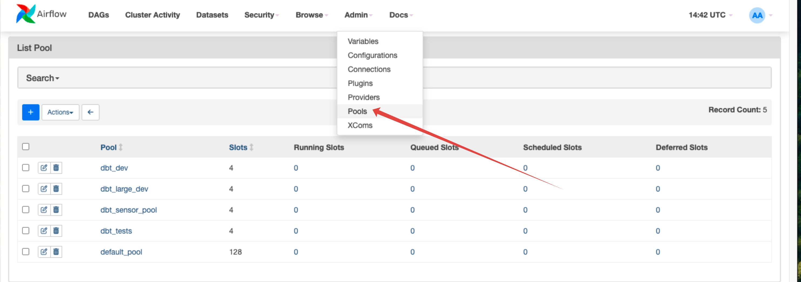

# dbt-af Tutorial

## Quick Start
### Prerequisites
1. Running instance of Airflow. There are a few ways to get this. The easiest is to use the Docker Compose to get a local instance running. See [docs](using_docker_compose.md) for more information.
2. Install `dbt-af` if you are not using the Docker Compose method.
    - via pip: `pip install dbt-af[tests,examples]`
3. Build dbt manifest. You can use the provided [script](./dags/build_manifest.sh) to build the manifest.
```bash
cd examples/dags
./build_manifest.sh
```
4. Add `dbt_dev` and `dbt_sensor_pool` [pools](https://airflow.apache.org/docs/apache-airflow/stable/administration-and-deployment/pools.html) to Airflow.
   
    - By using Airflow UI 
    - By using Airflow CLI: `airflow pools set dbt_dev 4 "dev"`

    Start with some small numbers of open slots in pools. 
    If you are using your local machine, a large number of tasks can overflow your machine's resources.

## List of Examples
1. [Basic Project](basic_project.md): a single domain, small tests, and a single target.
2. [Advanced Project](advanced_project.md): several domains, medium and large tests, and different targets.
3. [Dependencies management](dependencies_management.md): how to manage dependencies between models in different domains.
4. [Manual scheduling](manual_scheduling.md): domains with manual scheduling.
5. [Maintenance and source freshness](maintenance_and_source_freshness.md): how to manage maintenance tasks and source freshness.
6. [Kubernetes tasks](kubernetes_tasks.md): how to run dbt models in Kubernetes.
7. [Integration with other tools](integration_with_other_tools.md): how to integrate dbt-af with other tools.
8. [\[Preview\] Extras and scripts](extras_and_scripts.md): available extras and scripts.

