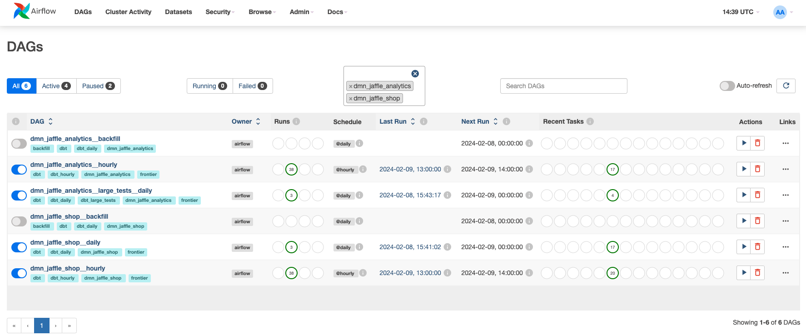
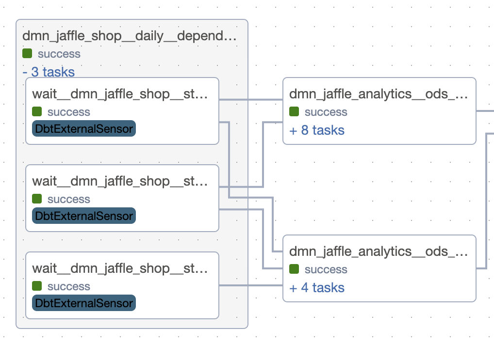
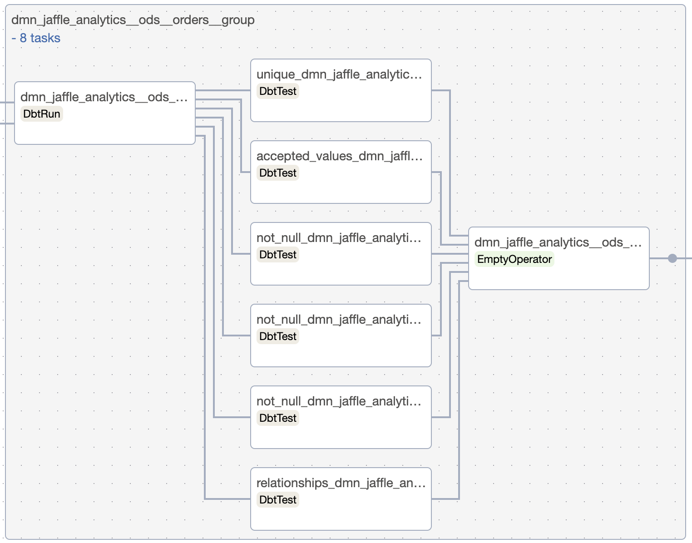
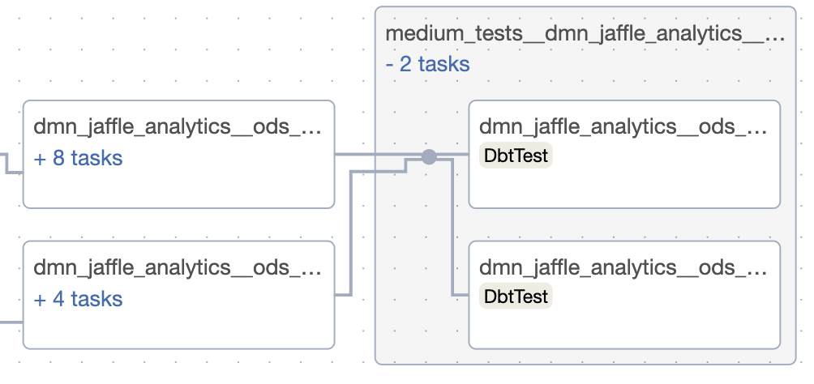

# Tutorial: multi-domain, tests, targets

## Table of contents

1. [Cross-domain dependencies](#cross-domain-dependencies)
2. [Small tests](#small-tests)
3. [Medium tests](#medium-tests)
4. [Large tests](#large-tests)
5. [Using different targets](#using-different-targets)
6. [Explicit dbt target](#explicit-dbt-target)
7. [Customizing retries](#customizing-retries)

DAG file: [example_advanced_dbt_af_dag.py](dags/example_advanced_dbt_af_dag.py)



This tutorial will show you how to create a multi-domain project with tests and use different dbt targets.

Essentially, we will create a project that has this structure:

```plaintext
├── etl_service/
│   ├── dbt/
│   │   ├── models/
│   │   │   ├── dmn_jaffle_analytics/
│   │   │   │   ├── ods/ (@hourly scheduling)
│   │   │   │   │   ├── dmn_jaffle_analytics.ods.customers.sql
│   │   │   │   │   ├── dmn_jaffle_analytics.ods.customers.yml
│   │   │   │   │   ├── ... (models from the ods layer)
│   │   │   ├── dmn_jaffle_shop/
│   │   │   │   ├── ods/ (@hourly scheduling)
│   │   │   │   │   ├── dmn_jaffle_shop.ods.customers.sql
│   │   │   │   │   ├── dmn_jaffle_shop.ods.customers.yml
│   │   │   │   │   ├── ... (models from the ods layer)
│   │   │   |   ├── staging/ (@daily scheduling)
│   │   │   │   │   ├── dmn_jaffle_shop.staging.customers.sql
│   │   │   │   │   ├── dmn_jaffle_shop.staging.customers.yml
│   │   │   │   │   ├── ... (models from the staging layer)
│   │   ├── seeds/
│   │   │   ├── dmn_jaffle_shop/
│   │   │   │   ├── raw/
│   │   │   │   │   ├── dmn_jaffle_shop.raw.customers.csv
│   │   │   │   │   ├── dmn_jaffle_shop.raw.orders.csv
│   │   │   │   │   ├── ... (seeds from the raw layer)
├── dbt_project.yml
├── profiles.yml
```

We use one `dbt_project.yml` file and one `profiles.yml` file to manage the different etl services. ETL service is a
logically separated part of the project that has its own dbt models, seeds, and tests. Each ETL service must be run
independently of the others, maybe even in separate Airflow instance.

## Cross-domain dependencies

All models in `dmn_jaffle_analytics.ods` refer models from `dmn_jaffle_shop.ods`. This will create for each dependency a
group with sensors to start execution of the dependent group only when the upstream models are finished.



## Small tests

All dbt tests that are not tagged get `@small` tag. All small tests for one models will be collected in the same task
group. They will be run immediately after the models are finished, and if any of them fails, the downstream models won't
be executed.



Each test will appear in the separate operator to make all runs atomic.

To handle tasks execution order properly between task groups, all tasks are connected to their downstreams and each task
group has _endpoint_ (dummy task) task that is connected to the next task group.

## Medium tests

Medium tests are designed to be non-blocking for the downstream models and be more time- and resource-consuming. They
are run after all models in the DAG.

To set up medium test just add `@medium` tag to the test.

```yaml
tests:
  - unique: # or any other test
      tags: [ "@medium" ]
```

Medium tests are binding to all DAG's leaves.



## Large tests

Large tests are designed to be most heavy and time-consuming. They are placed in special DAG for each domain (DAGs are
named like _<domain_name>\_\_large_tests_).
All DAGs with large tests have `@daily` scheduling.


## Using different targets

Because of different payloads, it might be useful to use different targets for different models' and tests' types. Some
of them require more resources, some of them are more time-consuming, and some of them are more important.

With `dbt-af` it's required to set up four targets in `dbt_project.yml` file for all models and seeds:

```yaml
models:
  sql_cluster: "dev"
  daily_sql_cluster: "dev"
  py_cluster: "dev"
  bf_cluster: "dev"

seeds:
  sql_cluster: "dev"
  daily_sql_cluster: "dev"
  py_cluster: "dev"
  bf_cluster: "dev"
```

and to set up default targets in `dbt-af` config:

```python
from dbt_af.conf import Config, DbtDefaultTargetsConfig

config = Config(
    # ...
    dbt_default_targets=DbtDefaultTargetsConfig(
        default_target='dev',
        default_for_tests_target='dev',  # could be undefined, then default_target will be used
    ),
    # ...
)
```

In this example, all models and seeds are going to be run at _dev_ target. But you can customize it for your needs for
each domain and each layer.

### How is the target determined?

There are a few rules to determine the target for the task:

- If the node is _test_, then `config.dbt_default_targets.default_for_tests_target` target is used.
- If the node is _model_:
    - If there are no pre-hooks, it's _sql_ model, and scheduling is `@daily` or `@weekly`, then `daily_sql_cluster`
      target is used.
    - Otherwise, `sql_cluster` target is used.
- Otherwise, use `py_cluster` target.

## Explicit dbt target

In rare cases, you might want to run a specific model at a specific target. You can do this by setting the `dbt_target`
parameter in the model's config.

```yaml
config:
  dbt_target: large_dev
```

## Customizing retries

Since dbt-af is built from different DAG components (dbt tasks, sensors, etc.),
you can customize retries for each component type.
To do this, you can specify desired retry policies in the `dbt-af` config.

By default, there's a default retry policy for all components,
but you can override it for each component type individually:

```python
from datetime import timedelta
from dbt_af.conf import Config, RetriesConfig, RetryPolicy

config = Config(
    # ...
    retries_config=RetriesConfig(
        default_retry_policy=RetryPolicy(
            retries=1,
            retry_delay=timedelta(minutes=5),
            retry_exponential_backoff=True,
            max_retry_delay=timedelta(minutes=30)
        ),
        dbt_run_retry_policy=RetryPolicy(retries=3),
    )
    # ...
)
```

All unspecified policies or policies' parameters will fall back to the default retry policy.

## List of Examples

1. [Basic Project](basic_project.md): a single domain, small tests, and a single target.
3. [Dependencies management](dependencies_management.md): how to manage dependencies between models in different
   domains.
4. [Manual scheduling](manual_scheduling.md): domains with manual scheduling.
5. [Maintenance and source freshness](maintenance_and_source_freshness.md): how to manage maintenance tasks and source
   freshness.
6. [Kubernetes tasks](kubernetes_tasks.md): how to run dbt models in Kubernetes.
7. [Integration with other tools](integration_with_other_tools.md): how to integrate dbt-af with other tools.
8. [\[Preview\] Extras and scripts](extras_and_scripts.md): available extras and scripts.
