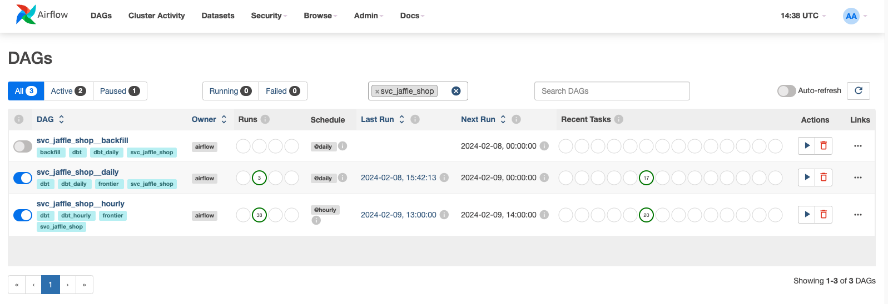
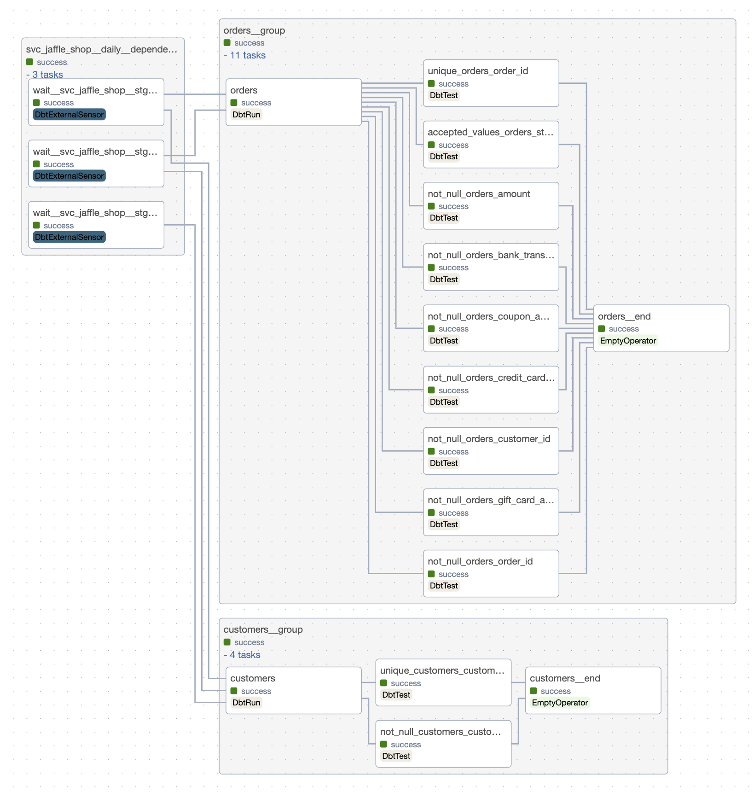
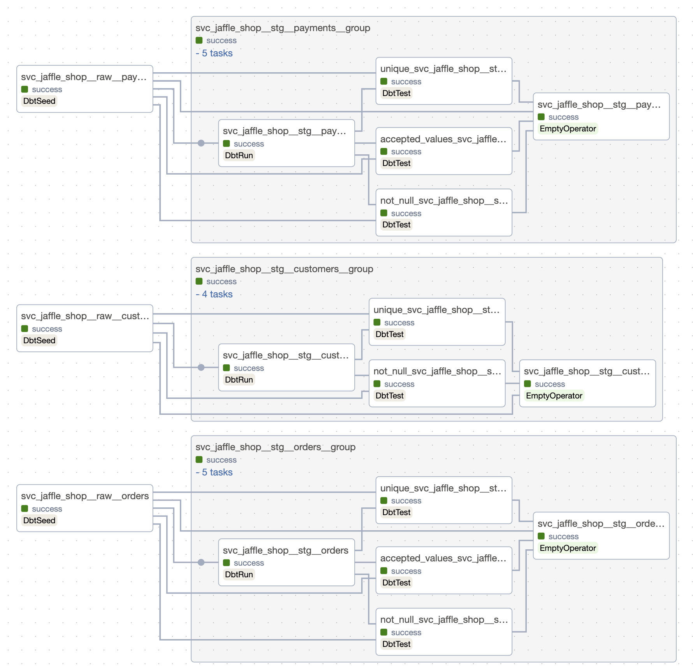

# Running the basic project
As an example, we use the [jaffle_shop](https://github.com/dbt-labs/jaffle_shop) dbt project with some useful modifications.
As `dbt-af` is domain-oriented tools, there's domain `svc_jaffle_shop` in the example. It's a simple domain with all the models, tests and seeds.

DAG file: [example_dbt_af_dag.py](dags/example_dbt_af_dag.py)



Modifications:
1. Models on _staging_ layer have `@daily` scheduling. They appear in `svc_jaffle_shop__daily` Airflow DAG that has daily scheduling.
2. Models _customers_ and _orders_ have `@hourly` scheduling. Models in _svc_jaffle_shop_ domain with `@hourly` scheduling appear in `svc_jaffle_shop__hourly` DAG. All cross-domain or cross-scheduling dependencies are resolved by `waits` (sensors in Airflow).
3. Dbt project structure is modified to have domain-layered structure.

Here's the DAGs layout:

|                     Hourly DAG                      |                      Daily DAG                      |
|:---------------------------------------------------:|:---------------------------------------------------:|
|  |  |

### Backfill DAGs
You may notice that `dbt-af` generated also backfill DAGs with naming patten `<domain_name>__backfill`. These DAGs have _@daily_ scheduling, but they are made to be triggered manually. 

The main purpose of these DAGs is to backfill the data in case of any issues with the regular DAGs. The backfill DAGs are generated for all domains, and they are not dependent on each other.

To backfill any data interval, you need just to trigger the DAG with the specific date interval, and it will run all the models with tests in one domain.

### Single model DAG
By default `dbt-af` will generate unified DAG with name `dbt_run_model`. This DAG is made for manual run of a single model. It's useful for debugging or backfilling a single model with specified date interval.

To turn off just set `include_single_model_manual_dag` to `False` in the `dbt-af` configuration.
```python
from dbt_af.conf import Config


config = Config(
    # ...
    include_single_model_manual_dag=False,
    # ...
)
```