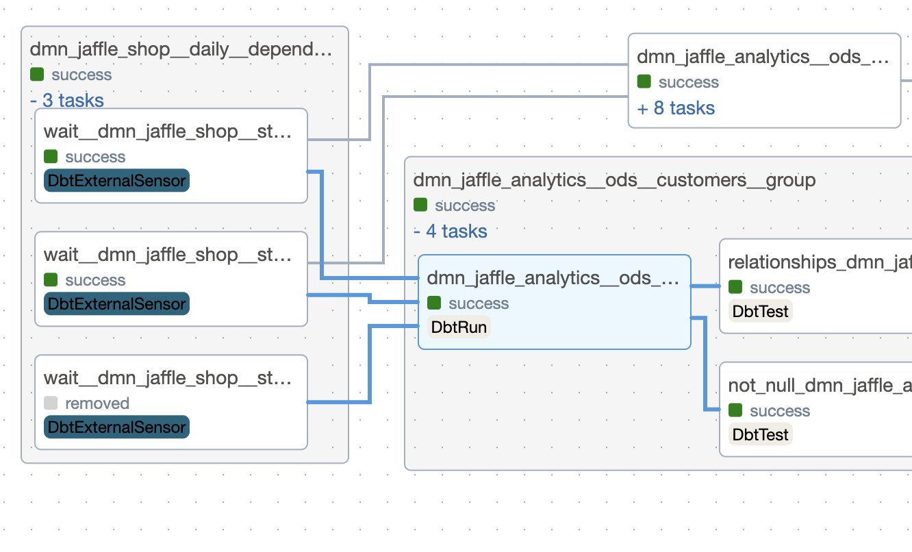
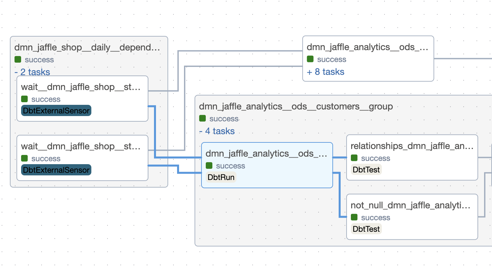

# Tutorial: Dependencies Management

`dbt-af` brings a new way to manage dependencies between models.
This is done by using the `dependencies` section in model's config.

There are two features that `dbt-af` brings to the table:

- skipping upstream dependencies
- wait not only last upstream model run, but all runs between the last and the current model runs

## Skipping upstream dependencies

Sometimes it's required to run the model as soon as possible, without waiting for the upstream models to be finished.
This can be achieved by setting `skip` to `true` in the `dependencies` section of the model's config.

```yaml
config:
  dependencies:
    upstream.model.name:
      skip: true
```

To try this feature, go
to [dmn_jaffle_analytics/ods/dmn_jaffle_analytics.ods.customers.sql](dags/advanced_jaffle_shop/dbt/models/dmn_jaffle_analytics/ods/dmn_jaffle_analytics.ods.customers.yml)
and add the following code to the `config` section:

```yaml
dependencies:
  dmn_jaffle_shop.stg.customers:
    skip: true
```

and run [script](dags/build_manifest.sh) to build manifest file.

This will affect `dmn_jaffle_analytics__hourly` DAG: the `dmn_jaffle_analytics.ods.customers` model won't have
dependency on `dmn_jaffle_shop.stg.customers`.

|                With dependency                 |             Without dependency             |
|:----------------------------------------------:|:------------------------------------------:|
|  |  |


## Wait policy for upstream dependencies

If your model with rarer scheduling depends on the model with more frequent scheduling, you may want to wait for all
runs of the upstream model between the last and the current model runs. 

For example, if the model has `@daily` scheduling and depends on `@hourly` model, it's possible to wait for all 24 last 
runs (default behavior is to wait for only the last run).

This can be achieved by setting `wait_policy` to `all` in the `dependencies` section of the model's config:

```yaml
config:
  dependencies:
    upstream.model.name:
      wait_policy: all
```

> :warning: This setting could generate a lot of tasks in your DAG. Be cautious here! If you still want to use this, consider updating number of slots in `dbt_sensor_pool` pool.


## List of Examples
1. [Basic Project](basic_project.md): a single domain, small tests, and a single target.
2. [Advanced Project](advanced_project.md): several domains, medium and large tests, and different targets.
4. [Manual scheduling](manual_scheduling.md): domains with manual scheduling.
5. [Maintenance and source freshness](maintenance_and_source_freshness.md): how to manage maintenance tasks and source freshness.
6. [Kubernetes tasks](kubernetes_tasks.md): how to run dbt models in Kubernetes.
7. [Integration with other tools](integration_with_other_tools.md): how to integrate dbt-af with other tools.
8. [\[Preview\] Extras and scripts](extras_and_scripts.md): available extras and scripts.